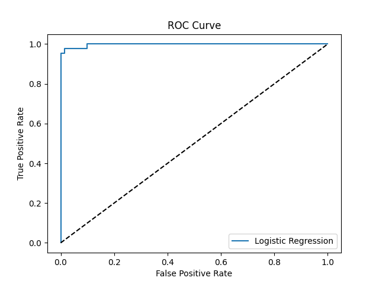

# 🧠 Logistic Regression: Binary Classification (Task 4)

## 📌 Objective
Build a binary classifier using **Logistic Regression** to predict whether a tumor is **malignant (1)** or **benign (0)** using the **Breast Cancer Wisconsin dataset**.

---

## 📊 Dataset
- Source: [Breast Cancer Wisconsin Dataset](https://www.kaggle.com/datasets/uciml/breast-cancer-wisconsin-data)
- Features: 30 numeric features related to tumor characteristics
- Target: `diagnosis` (M = malignant, B = benign → converted to 1 & 0)

---

## 🔧 Tools Used
- Python
- Pandas
- Scikit-learn
- Matplotlib
- NumPy

---

## 🧪 Steps Followed

1. **Data Cleaning**: Removed `Unnamed: 32` and `id` columns.
2. **Label Encoding**: Converted 'M'/'B' to 1/0.
3. **Train/Test Split**: 80% training, 20% testing.
4. **Feature Scaling**: Standardized features using `StandardScaler`.
5. **Model**: Fitted a `LogisticRegression` model.
6. **Evaluation**:
   - Confusion Matrix
   - Precision & Recall
   - ROC-AUC Curve
7. **Threshold Tuning**: Adjusted threshold to 0.3 to observe changes in precision/recall.
8. **Sigmoid Function**: Used to understand prediction probability.

---

## 📈 Results

- **Confusion Matrix**:
  ```
  [[70  1]
   [ 2 41]]
  ```

- **Precision**: 0.976  
- **Recall**: 0.953  
- **ROC-AUC Score**: 0.997

### 🔄 After Threshold Tuning (0.3)
- **Precision**: 0.913  
- **Recall**: 0.976  

---

## 📉 ROC Curve



---

## 🧮 Sigmoid Function
Used in Logistic Regression to convert linear outputs into probabilities.

```
Sigmoid(x) = 1 / (1 + e^-x)
Sigmoid(0) = 0.5
Sigmoid(2) = 0.88
```

---

## 📂 Files in This Repo
- `logistic_regression_task4.py` – complete working code
- `roc_curve.png` – saved ROC graph
- `README.md` – this file

---

## ✅ Conclusion
Achieved near-perfect classification using Logistic Regression with proper preprocessing, model evaluation, and threshold tuning.

---
## ▶️ How to Run
1. Download the dataset and save `Housing.csv` in the same directory as the script.
2. Run the script using:

```bash
python main.py
